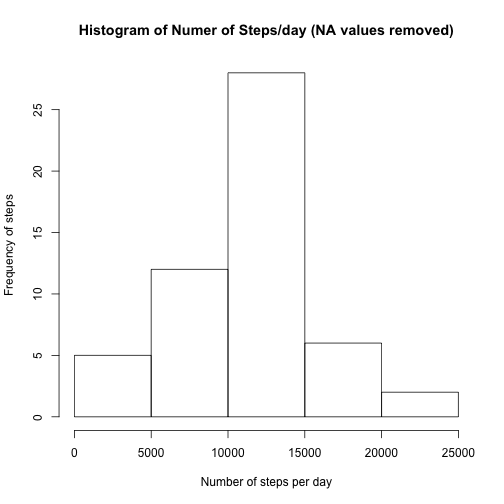
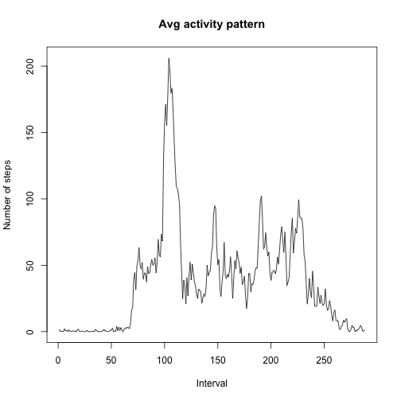
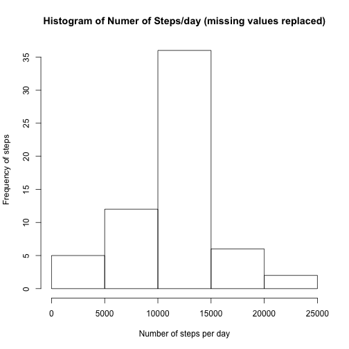
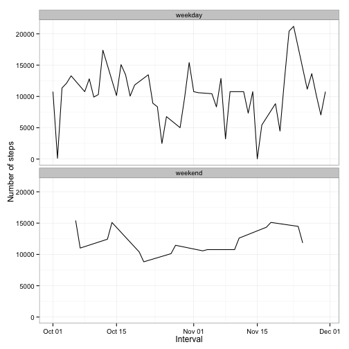

### Loading and preprocessing the data


```r
library(graphics)
library(ggplot2)
```

Load in the dataset


```r
activity <- read.csv("activity.csv")
summary(activity) #2304 NA values
```

```
##      steps                date          interval     
##  Min.   :  0.00   2012-10-01:  288   Min.   :   0.0  
##  1st Qu.:  0.00   2012-10-02:  288   1st Qu.: 588.8  
##  Median :  0.00   2012-10-03:  288   Median :1177.5  
##  Mean   : 37.38   2012-10-04:  288   Mean   :1177.5  
##  3rd Qu.: 12.00   2012-10-05:  288   3rd Qu.:1766.2  
##  Max.   :806.00   2012-10-06:  288   Max.   :2355.0  
##  NA's   :2304     (Other)   :15840
```

```r
head(activity)
```

```
##   steps       date interval
## 1    NA 2012-10-01        0
## 2    NA 2012-10-01        5
## 3    NA 2012-10-01       10
## 4    NA 2012-10-01       15
## 5    NA 2012-10-01       20
## 6    NA 2012-10-01       25
```
Check to see if the data need to be converted/processed

```r
class(activity$date) #The dates are a factor
```

```
## [1] "factor"
```

```r
class(activity$interval) #The intervals are an integer
```

```
## [1] "integer"
```

```r
class(activity$steps) #The steps are an integer
```

```
## [1] "integer"
```
Convert the date factors to dates and the intervals to factors.

```r
activity$date <- as.Date(activity$date, format = "%Y-%m-%d") 
#Convert the intervals to factors
activity$interval <- as.factor(activity$interval)
class(activity$date) #The dates are now a date
```

```
## [1] "Date"
```

```r
class(activity$interval) #The intervals are now in a factor format
```

```
## [1] "factor"
```

###What is mean total number of steps taken per day?
We will solve this by calculating the total number of steps taken per day. To do this, first sort the data into each day (there are two months of data, taken in Oct and Nov 2012). Use the aggregrate function with the 'sum' function to find the total number of steps each day.

```r
activity_by_day<-aggregate(activity["steps"], by=activity["date"], FUN=sum)
head(activity_by_day)
```

```
##         date steps
## 1 2012-10-01    NA
## 2 2012-10-02   126
## 3 2012-10-03 11352
## 4 2012-10-04 12116
## 5 2012-10-05 13294
## 6 2012-10-06 15420
```

```r
str(activity_by_day)
```

```
## 'data.frame':	61 obs. of  2 variables:
##  $ date : Date, format: "2012-10-01" "2012-10-02" ...
##  $ steps: int  NA 126 11352 12116 13294 15420 11015 NA 12811 9900 ...
```

```r
summary(activity_by_day) #Min 41 steps, max 21194 steps, 8 NAs
```

```
##       date                steps      
##  Min.   :2012-10-01   Min.   :   41  
##  1st Qu.:2012-10-16   1st Qu.: 8841  
##  Median :2012-10-31   Median :10765  
##  Mean   :2012-10-31   Mean   :10766  
##  3rd Qu.:2012-11-15   3rd Qu.:13294  
##  Max.   :2012-11-30   Max.   :21194  
##                       NA's   :8
```
Create a histogram (using the graphics package) of the total number of steps taken each day. Look at a histogram of the frequency by steps. Calculate the mean and the median of the number of steps/day (ignoring the NA values). 

```r
hist(activity_by_day$steps, main=paste("Histogram of Numer of Steps/day (NA values removed)"), xlab="Number of steps per day", ylab="Frequency of steps")
```

 

```r
#Put (report) these values into a sentence when I do the RMarkdown
#mean (NAs removed):10766.19
mean_steps<-format(round(mean_steps<-mean(activity_by_day$steps, na.rm=TRUE)), scientific=FALSE) 
#median (NAs removed):10765
median_steps<-format(round(median(activity_by_day$steps, na.rm=TRUE)), scientific=FALSE)
```
The mean number of steps is 10766 and the median number of steps is 10765.

###What is the average daily activity pattern?
Sort the data into the 5-minute intervals (x-axis) and the average number of steps taken, averaged across all days (y-axis). For the plot, convert the intervals from a factor to an integer else 'type=l' will be ignored since the plot function will default to plot.factor, which does not take a type. 

```r
activity_by_interval<-aggregate(activity["steps"], by=activity["interval"], FUN=mean, na.rm=TRUE) 
plot(as.integer(activity_by_interval$interval), activity_by_interval$steps, type="l", ylab="Number of steps", xlab="Interval", main="Avg activity pattern")
```

 

```r
head(activity_by_interval)
```

```
##   interval     steps
## 1        0 1.7169811
## 2        5 0.3396226
## 3       10 0.1320755
## 4       15 0.1509434
## 5       20 0.0754717
## 6       25 2.0943396
```


```r
max_step <- round(max(activity_by_interval$steps), digits=2) #The max step is 206
max_interval <-round(which.max(activity_by_interval$steps))
head(max_interval) #The max steps occurs at the 104th interval value (need to convert back to time interval)
```

```
## [1] 104
```
On average, across all the days in the dataset, the 5-minute interval that contains the maximum number of steps (206.17) occurs at interval 104 of the data.

###Imputing missing values
The strategy being used here to fill in the missing NA data values in the original dataset is to first make a copy of hte original dataset then replace the NA values with the activity_by_interval data (i.e. using the average daily step data found in the previous section).

```r
missing_values <- round(sum(is.na(activity$steps))) #There are 2304 NAs in dataset
head(activity) #This is the original dataset
```

```
##   steps       date interval
## 1    NA 2012-10-01        0
## 2    NA 2012-10-01        5
## 3    NA 2012-10-01       10
## 4    NA 2012-10-01       15
## 5    NA 2012-10-01       20
## 6    NA 2012-10-01       25
```

```r
replaced_data<-activity #Make a copy of the original dataset
#Replace the NAs in the original data with the activity_by_interval data
for (i in 1:nrow(replaced_data)) {
    if (is.na(replaced_data$steps[i])) {
        replaced_data$steps[i] <- activity_by_interval[which(replaced_data$interval[i] == activity_by_interval$interval), ]$steps
    }
}
head(replaced_data)
```

```
##       steps       date interval
## 1 1.7169811 2012-10-01        0
## 2 0.3396226 2012-10-01        5
## 3 0.1320755 2012-10-01       10
## 4 0.1509434 2012-10-01       15
## 5 0.0754717 2012-10-01       20
## 6 2.0943396 2012-10-01       25
```
Check that there are no missing values in this newly created dataset.

```r
missing_values <- round(sum(is.na(replaced_data$steps))) #There are no NAs in this new dataset
```
The number of missing values in this new dataset is 0.
Now to plot this new dataset with the missing values replaced.

```r
replaced_data_activity_by_day<-aggregate(replaced_data["steps"], by=replaced_data["date"], FUN=sum)
hist(replaced_data_activity_by_day$steps, main=paste("Histogram of Numer of Steps/day (missing values replaced)"), xlab="Number of steps per day", ylab="Frequency of steps")
```

 


```r
#Disable scientific notation output in RMarkdown using format(function, scientific=FALSE)
mean_steps_replaced<-format(round(mean_steps_replaced<-mean(replaced_data_activity_by_day$steps), digits=2), scientific=FALSE) 
#median (NAs replaced): 10766
median_steps_replaced<-format(round(median(replaced_data_activity_by_day$steps), digits=2), scientific=FALSE)
```
With the NA values replaced, the mean number of steps per day is 10766.19 and the median of the number of steps per day is 10766.19. These values are not very different from the mean (10766) and the median (10765) number of steps per day in the data with the NA values.

###Are there differences in activity patterns between weekdays and weekends?
Use the weekdays() function to create a column with the days of the week appended to the dataset.

```r
#Add a column of data with weekday names
replaced_data_activity_by_day$weekday<-weekdays(replaced_data_activity_by_day$date)
#Make a copy of this dataset
data_by_days<-replaced_data_activity_by_day
```
Now split the data into week days and weekend days

```r
weekend_data <- subset(data_by_days, weekday %in% c("Saturday","Sunday"))
weekday_data <- subset(data_by_days, !weekday %in% c("Saturday","Sunday"))
#Replace "Sat" and "Sun" with "weekend"
weekend_data$weekday <- ifelse(weekend_data$weekday > "Friday","weekend", "")
#Replace "Mon" etc with "weekday"
weekday_data$weekday <- ifelse(weekday_data$weekday >="Monday","weekday", "weekday")
```
Recombine the weekend and weekday data using 'rbind' (this appends weekdays to the end of the file) 

```r
data_by_days_final<-rbind(weekend_data, weekday_data)
head(data_by_days_final)
```

```
##          date steps weekday
## 6  2012-10-06 15420 weekend
## 7  2012-10-07 11015 weekend
## 13 2012-10-13 12426 weekend
## 14 2012-10-14 15098 weekend
## 20 2012-10-20 10395 weekend
## 21 2012-10-21  8821 weekend
```
Plot the final dataset by weekend and weekday

```r
ggplot(data_by_days_final, aes(x=date, y=steps)) + geom_line(color="black") + facet_wrap(~ weekday, nrow=2, ncol=1) + labs(x="Interval", y="Number of steps") + theme_bw()
```

 

Overall, the number of steps taken during the weekday is generally at a higher level than the number of steps taken during the weekend.
